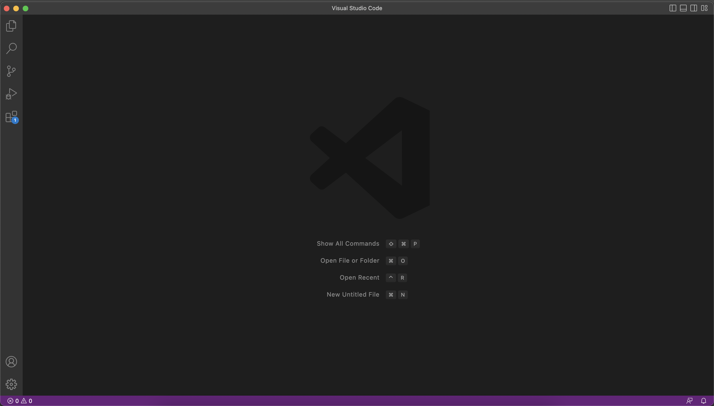
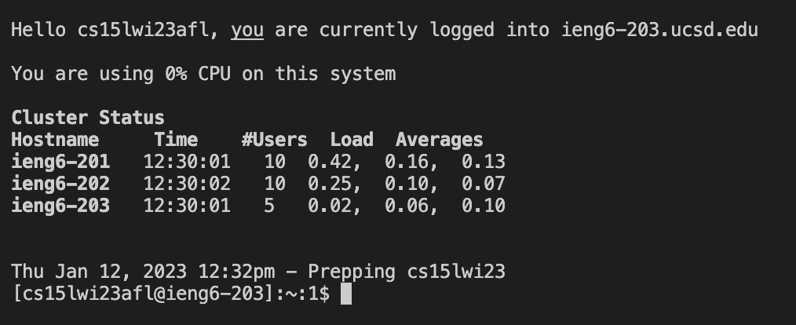
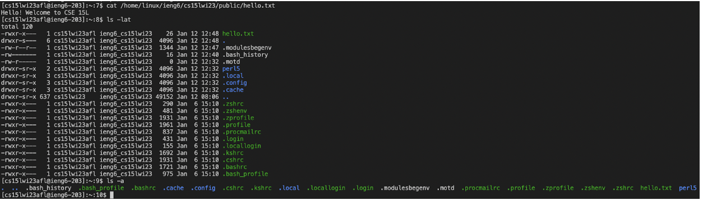

# Lab Report 1 - Remote Access and Filesystem

## Part 1 - Installing VScode

First, we will be setting up a coding environment. It will provide a convenient way to use the terminal, which we will need to connect to the CSE remote servers. Install [Visual Studio Code](https://code.visualstudio.com/) by clicking on the link, and follow the installation instructions on the site. After successful installation, open the application and you should see a screen like this:

## Part 2 - Remotely Connecting

Now we are ready to connect to the remote servers. For Windows users, `git` must be installed first. If you're using macOS like me then the tools we need are already installed and we can move on. Open a terminal in VS Code by clicking "Terminal", and then "New Terminal". Input the command `ssh cs15lwi23***@ieng6.ucsd.edu`, making sure to replace `***` with your username specific information. If it's your first time connecting to this server, you will see a message asking if you are sure you would like to connect (for security reasons). Say `yes`, and then input your password (Note: you won't see your password on the screen as you're typing it). This is what my screen looked like once I logged in.

## Part 3 - Trying Some Commands

Now that we're connected to the remote server, we are ready to try some commands. The simplest command to try is `lsc-a` which will list all files and directories in the current directory. We can add to this command with `ls -lat` which also creates a list, but now with extra information for each item and in order of time created. Finally, we can try `cat /home/linux/ieng6/cs15lwi23/public/hello.txt` to print out the contents of the text file `hello.txt`. Here's what that all looked like on my screen:
