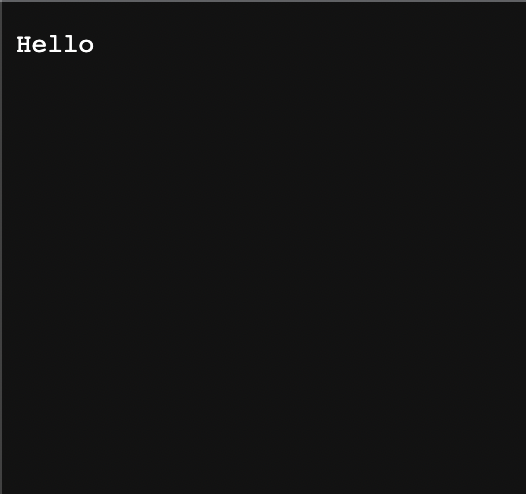
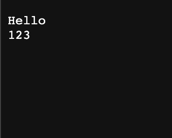
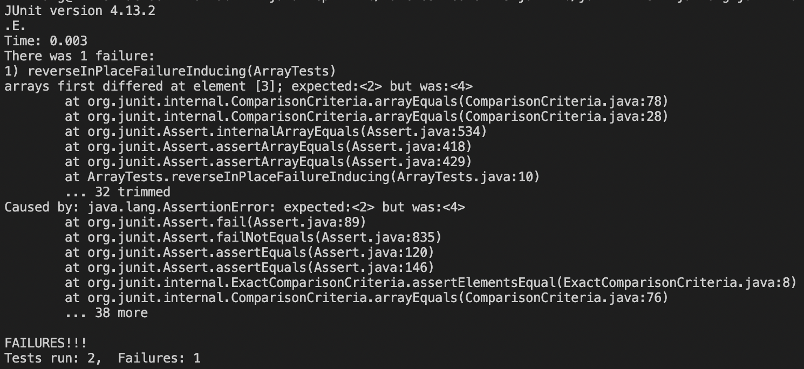

# Lab Report 2 - Servers and Bugs

## Part 1

I made a web server called `StringServer` that takes requests to append new 
lines to a running string which it stores and displays. Here is the code for 
it:

    import java.io.IOException;
    import java.net.URI;

    class Handler implements URLHandler {

        String str = "";

        public String handleRequest(URI url) {
            if (url.getPath().equals("/")) {
                return str;
            } else {
                if (url.getPath().contains("/add-message")) {
                    String[] parameters = url.getQuery().split("=");
                    if (str.equals("")) {
                        str = str + parameters[1];
                        return str;
                    } else  {
                        str = str + "\n" + parameters[1];
                        return str;
                    }
                }
                return "404 Not Found!";
            }
        }
    }

    class StringServer {
        public static void main(String[] args) throws IOException {
            if(args.length == 0){
                System.out.println("Missing port number! Try any number between 1024 to 49151");
                return;
            }

            int port = Integer.parseInt(args[0]);
            Server.start(port, new Handler());
        }
    }

This is what the site displays after requesting `/add-message?s=Hello`:

This request first executes `main` in `StringServer` which takes the port number in the URL and passes it as an argument to the `start` method from the `Server` class. Then `handleRequest` is called, which takes the URL as an argument and parses the path and query. In this case, the string `"Hello"` is concatenated to the field `str` which is set to the empty string `""` by default.

This is what the site displays after requesting `/add-message?s=123`:

This request induces much of the same execution as the previous request. However, now that `str` is no longer empty, the request concatenates the new line character `\n` before `123`. So we now have `str.equals("Hello\n123")`.

## Part 2

Let's look at the `reverseInPlace` method from the `ArrayExamples` class. Here are a couple of JUnit tests that do and do not induce failures, respectively:

    import static org.junit.Assert.*;
    import org.junit.*;
    
    public class ArrayTests {

        @Test
        public void reverseInPlaceFailureInducing() {
            int[] input1 = { 1, 2, 3, 4, 5 };
            ArrayExamples.reverseInPlace(input1);
            assertArrayEquals(new int[]{ 5, 4, 3, 2, 1 }, input1);
        }

        @Test
        public void reverseInPlaceNoFailure() {
            int[] input1 = { 3 };
            ArrayExamples.reverseInPlace(input1);
            assertArrayEquals(new int[]{ 3 }, input1);
        }
    
    }

This is the output that was produced by running these JUnit tests:

This is what the buggy code looks like:

    public class ArrayExamples {
        // Changes the input array to be in reversed order
        static void reverseInPlace(int[] arr) {
            for(int i = 0; i < arr.length; i += 1) {
                arr[i] = arr[arr.length - i - 1];
            }
        }
    }

Here is the fixed version that behaves as expected:

    public class ArrayExamples {
        // Changes the input array to be in reversed order
        static void reverseInPlace(int[] arr) {
            for(int i = 0; i < arr.length/2; i += 1) {
                int curr = arr[i];
                arr[i] = arr[arr.length - i - 1];
                arr[arr.length - i - 1] = curr;
            }
        }
    }

The old version of the program changed the first half of the indices to the correct values, but it failed to keep the old values so they could be set in the second half of the indices. The new version of the program "reflects" the indices about the midpoint of the array, starting from the edges and terminating once the middle index has been reached.

## Part 3

In week 2's lab how to host local networks. I always assumed previosuly that servers were intrinsically remote objects, so it was illuminating to learn that they can be hosted on a local client as well.
