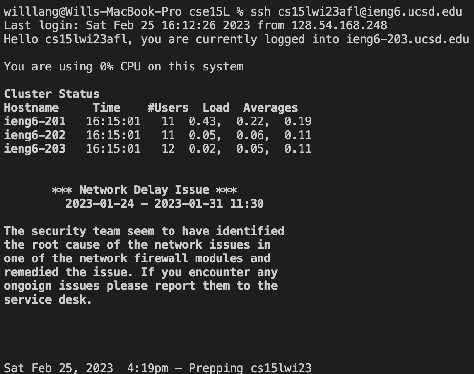
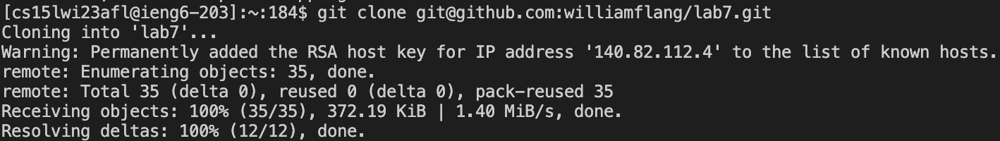
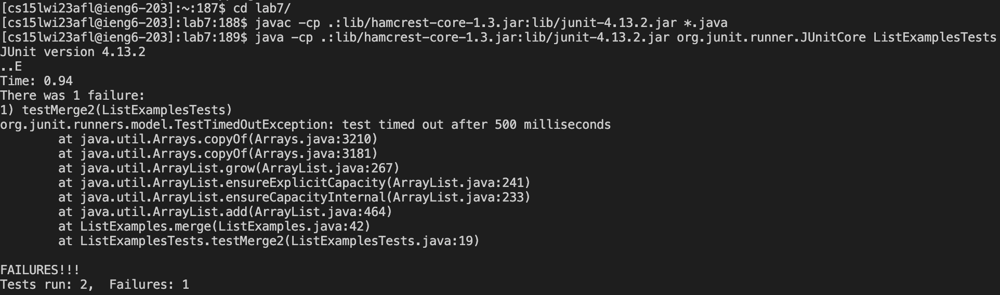
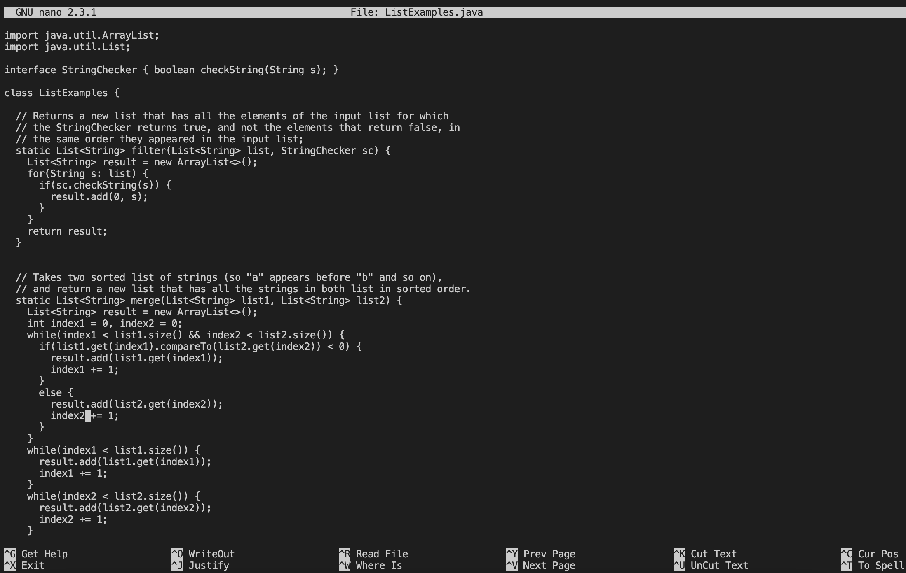
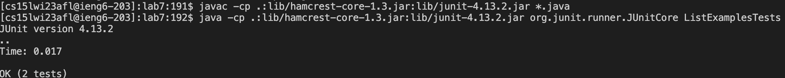
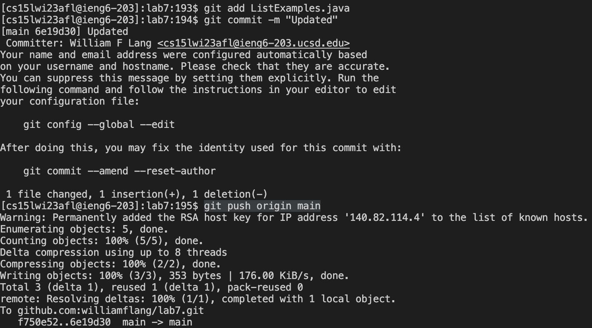

# Lab Report 4

## Step 4 - Log into ieng6

Keys pressed: `<up><return>`

The `ssh cs15lwi23afl@ieng6.ucsd.edu` command was 1 up in the search history, so I used up arrow to access it.

## Step 5 - Clone your fork of the repository from your Github account

Keys pressed: `git clone <command><V><return>`

I typed `git clone` manually and then copy-pasted the SSH key of my fork of the `lab7` repository from GitHub.

## Step 6 - Run the tests, demonstrating that they fail

Keys pressed: `cd l<tab><return>`,`<command><V><return>`,`<command><V><return> L<tab>T<tab><delete><return>`

I typed `cd l` manually and then tabbed to complete `lab7` and change to that directory. Then I copied `javac -cp .:lib/hamcrest-core-1.3.jar:lib/junit-4.13.2.jar *.java` from this lab report's instructions to compile the JUnit testers. Then I copied `java -cp .:lib/hamcrest-core-1.3.jar:lib/junit-4.13.2.jar org.junit.runner.JUnitCore` from the instructions and added `ListExamplesTests`, using tabbing to autocomplete (I deleted an extra `.` that was added at the end).

## Step 7 - Edit the code file to fix the failing test

Keys pressed: `nano L<tab>.j<tab><return>`,`<ctrl+W>index2 += 1<return>`,`<up><up><up><up><up><up><up><up><up><right><right><right><right><delete>2<ctrl+O><return>`,`<ctrl+X>`

I opened `ListExamples.java` in `nano` using tabbing to autocomplete. Then I navigated to the line that needed editing usigng the `Where is` functionality of `nano` and used arrow keys to get the rest of the way. I made the change, saved the file with `WriteOut` and exited `nano`.

## Step 8 - Run the tests, demonstrating that they now succeed

Keys pressed: `<up><up><up><return>`,`<up><up><up><return>`

The commands to compile and run the JUnit testers were already in my command search history, so I used up-arrow-keys to quickly retrieve and run them.

## Step 9 - Commit and push the resulting change to your Github account

Keys pressed: `git add L<tab>.j<tab><return>`,`git commit -m "Updated"<return>`,`git push origin main<return>`

I manually typed `git add` and used autocomplete to quickly fill in `ListExamples.java` and added the file to my new commit, then I committed the change with the simple message `"Updated"`, and finally pushed the change to the `main` branch of my repository.