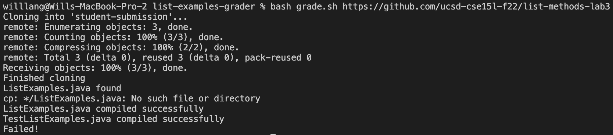
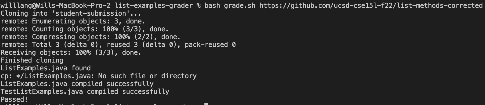
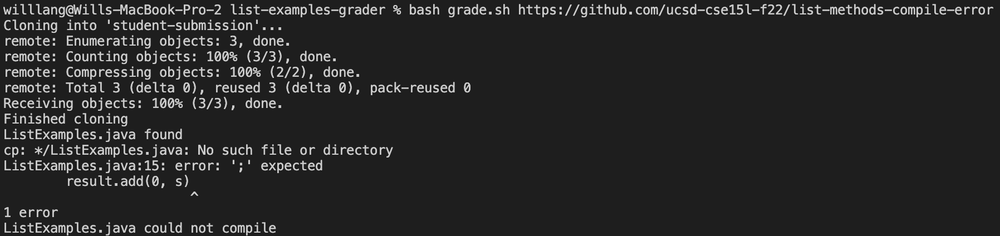
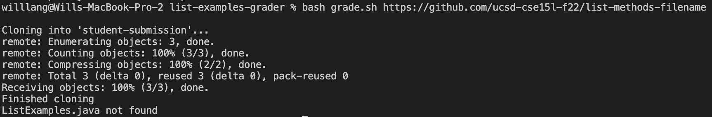
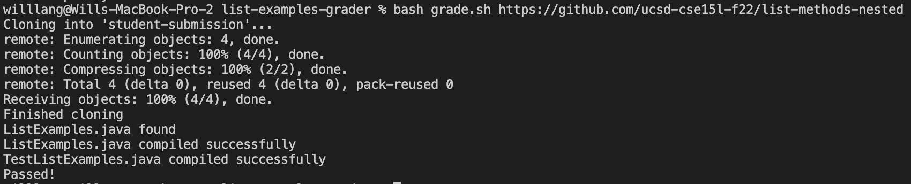

# Lab Report 5 - Finishing the grading script

I was not able to finish the grading script during lab time because I could not run git commands, so I decided to finish it now! (By the way, in case future students run into the issue, the fix was to install Xcode Command Line Tools using the command `xcode-select --install`; the package requires 1.2GB of space.)

Now I will show how my grader processes several different repositories.

## https://github.com/ucsd-cse15l-f22/list-methods-lab3

As you can see, cloning the repository, finding the correct java file, and compiling both the submitted file and the tester worked perfectly fine, but the tester indicated failed tests. Indeed, there are errors in `ListExamples.java`, so this behavior is expected of the grader. Don't worry about the line that says 'No such file or directory', this is simply a fragment from ensuring that `ListExamples.java` will be in the same directory as the tester file.

## https://github.com/ucsd-cse15l-f22/list-methods-corrected

As you can see, the tester caught no errors in the file, which is what we expected as this file correctly implemented the specifed methods.

## https://github.com/ucsd-cse15l-f22/list-methods-compile-error

In this case, a semi-colon was missing on one of the lines, so the submitted file would not be able to compile. The script catches this and indicates so.

## https://github.com/ucsd-cse15l-f22/list-methods-filename

This submission had a completely correct implementation, but the file was named incorrectly, so the script indicated that the specified file `ListExamples.java` could not be found.

## https://github.com/ucsd-cse15l-f22/list-methods-nested

This submission also had a completely correct implementation, and it was also named correctly. The only catch is that the `ListExamples.java` was kept in a nested directory within `student-submission`. The script accounts for this situation, and succeeds at finding the file even within nested directories (this is why we see the odd "No such file or directory" message on a lot of these). The submission gets graded as normal and passes.